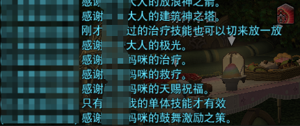
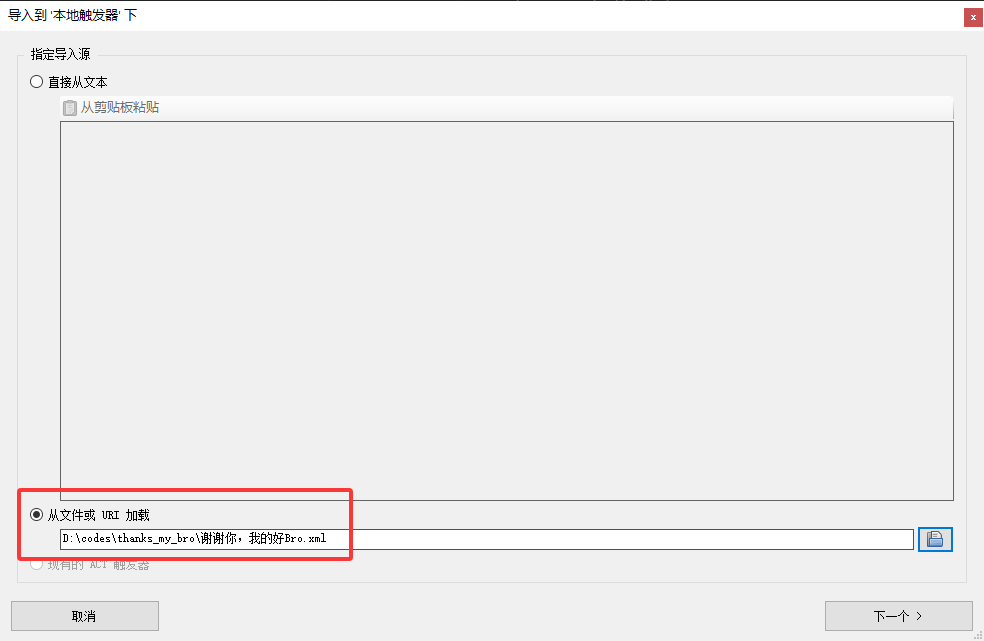
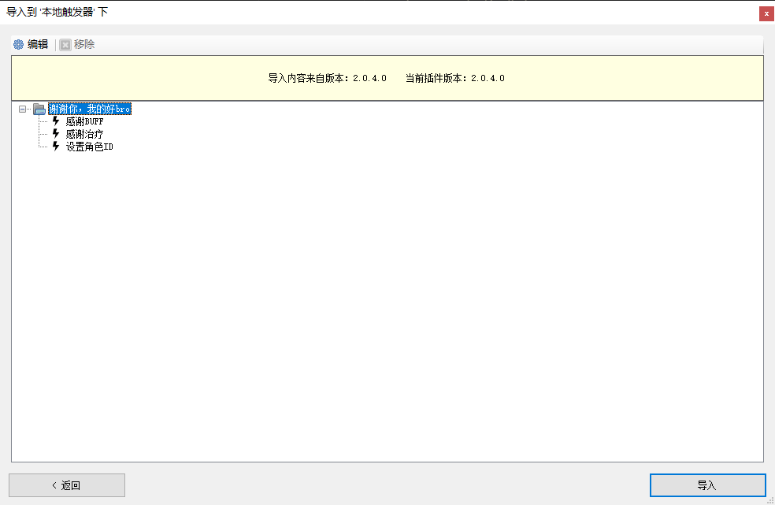
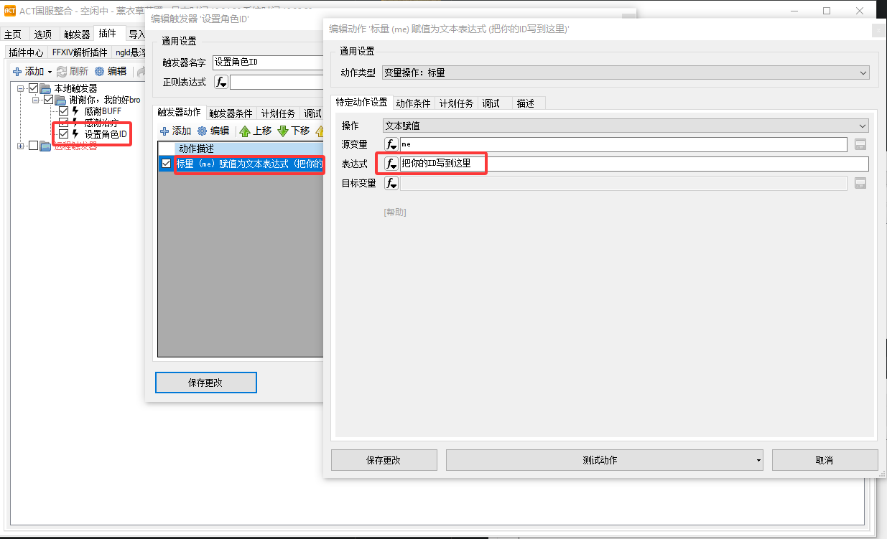
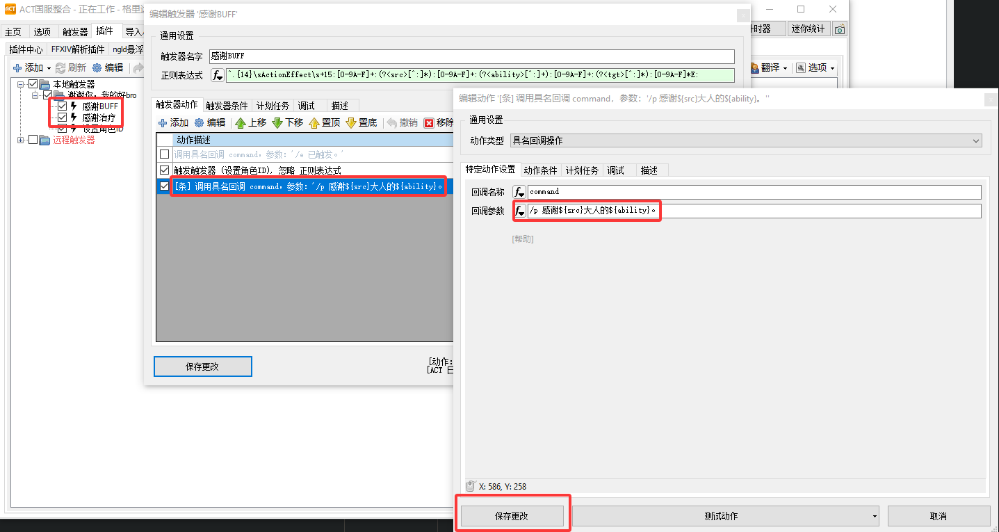

## ⚠️亚拉戈科技警告⚠️

## 谢谢你，我的好Bro！触发器

参考了这篇[文章](https://www.xiaohongshu.com/explore/67feef530000000009017000?app_platform=ios&app_version=8.94.2&share_from_user_hidden=true&xsec_source=app_share&type=normal&xsec_token=CBCB1f-sMSGZrdt8vgYFM3fEOU1YBIwXOeSxTo7P1sImU=&author_share=1&xhsshare=QQ&shareRedId=Nzs5M0g8SkI5TUpIQjoyRzw5PjtJNzxP&apptime=1771741518&share_id=c44503b38c5f4ded8c2057f9bfc74b6e)，在打本的过程自动在小队列表发送消息，第一时间感谢那些给你单奶或者塞时尚小单品给你的妈咪/大人们！

触发器会监测除你自己发动以外，其他所有与你相关的**单体**治疗/增益行为。至少应在2人小队中使用。

效果如下图所示:



### ⚠️严重提醒⚠️

注意，导入触发器后，将会自动在**⚠️小队频道⚠️**发送消息，虽然你感谢了你的好Bro，但这毕竟是那个那个，用之前请确认自己知道使用这一触发器可能产生的后果。

请注意使用的后果，可以首先参考[自定义表达](#自定义表达)小节，先将```感谢BUFF```和```感谢治疗```中的```/p```改为```/e```，即默语频道（只有自己能看到），游玩两次副本后再选择是否开启！

### 依赖

触发器依赖于 ```Triggernometry```，```Cactbot```，```鲶鱼精邮差```。

其中

Triggernometry / Cactbot:

* 呆萌ACT可以在 ```插件 - 获取插件 - 插件标题``` 中寻找并下载。
* 咖啡ACT如果默认并未安装，可以在 ```插件中心``` 中选择并启用。

鲶鱼精邮差[在这里](https://github.com/Natsukage/PostNamazu)。下载后在插件管理/中心中浏览并导入。

### 使用

1. 在页面**右侧**Releases下载```thanks_my_bro.xml```。

2. 依次选择```插件 - Triggernometry - 本地触发器 - 导入```


3. 选择```从文件中或URL加载```寻找下载过的```thanks_my_bro.xml```。选择```下一个 - 导入```




4. 按照如下操作 ```双击设置角色ID - 双击动作描述中第一条 - 将“把你的ID写到这里”改成你自己的角色ID - 左下方保存更改。```



### 自定义表达

参考如下步骤，可以自定义语句。


触发器包含如下变量：

```${src}```为施术者，即状态来源。

```${tgt}```为接受者，即自己。

```${var:me}```为自己的ID。

```${ability}```为释放的技能或被施加的状态。

例如 ```${src} = Player A```, ```${tgt} = Player B```，```${ability} = 再生```

则默认状态下```/p 感谢${src}大人的${ability}。```将会在小队列表发送```感谢Player A大人的再生。```

可以通过调整该语句自定义发送的内容。
